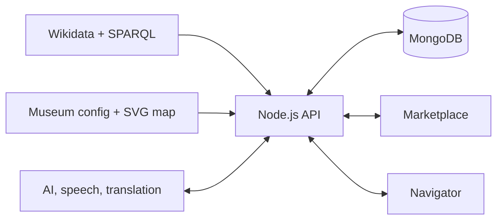

<p align="center">
  
</p>

# ArtAround

**A generic, accessible, and AI-assisted platform for creating and experiencing
museum visits.**

ArtAround connects a content marketplace with an in-museum navigator. Authors
and curators prepare reusable cultural content; visitors discover it, build
their own itineraries, and follow visits through maps, text, speech, QR codes,
and guided activities.

## Museum genericity

ArtAround is designed around museums as data, not as hard-coded applications.
A new venue is introduced through its identity, a set of artwork QIDs, and an
annotated SVG floor plan. The same marketplace, navigation engine, localization
tools, and content workflows then adapt to that museum.

The SVG is more than an illustration: it is a semantic map of rooms, floors,
artworks, services, connections, and obstacles. From it, ArtAround derives the
indoor graph used to organize visits and guide people through the building—no
external mapping platform or museum-specific routing code is required.

The repository currently includes four very different examples:

- British Museum
- Galleria degli Uffizi
- Metropolitan Museum of Art
- Musée du Louvre

Together they demonstrate that the model scales from small catalogs to more
than one hundred artworks and from horizontal layouts to multi-floor museums.

## AI-tailored visits

Visitors can ask for a visit shaped around their interests, available time, and
preferred style of explanation. ArtAround uses AI to select relevant works from
the real museum catalog and to prepare content that matches those constraints.

The result is still grounded in the museum: only known artworks can be chosen,
duplicates are removed, and the final itinerary follows the curatorial order of
the floor plan. AI enriches the experience, while identity, access, prices, and
routes remain controlled by the application.

The same constrained approach powers:

- descriptions for different audiences and reading times;
- natural-language requests mapped to a controlled command vocabulary;
- contextual explanations during a visit;
- custom itineraries created from visitor preferences.

ArtAround deliberately avoids a generic chatbot interface. AI appears inside
focused museum tasks, where its output can be validated and connected to real
artworks.

## Wikidata scraping and SPARQL

Museum catalogs begin with Wikidata QIDs. ArtAround queries the Wikidata Query
Service through SPARQL to collect structured information about museums and
artworks, including names, creators, artistic movements, locations, dates, and
Wikimedia images.

This ingestion process turns open cultural data into a local, navigable catalog:

- Wikidata provides stable semantic identities and metadata;
- Wikimedia images are cached locally with catalog-sized thumbnails;
- QIDs connect database records, SVG map nodes, API responses, and QR codes;
- repeatable seeding can progressively populate any configured museum.

The result is a bridge between Linked Open Data and the physical exhibition:
the same artwork identity is understood by the catalog, the map, and the
visitor's device.

## Accessible by design

ArtAround is built as a multimodal experience. The full flow can be operated by
keyboard, touch, screen reader, visible controls, or voice.

- Text-to-speech always reads the same description shown on screen.
- Every voice action has an equivalent button.
- Skip links, semantic regions, live announcements, labelled dialogs, and
  keyboard-focusable map nodes support assistive technologies.
- Strong focus indicators, light and dark themes, and reduced-motion preferences
  are shared across both applications.
- QR scanning and sensors are optional: manual codes, candidate selection, and
  map teleportation offer equivalent ways to establish a position.
- Responsive layouts support phones, tablets, and desktop browsers throughout
  the visit.

Accessibility is therefore not an alternate interface—it is part of the same
experience used by every visitor.

## Two connected experiences

### Marketplace

The marketplace supports three roles:

- **Visitors** discover and purchase content, maintain a collection, compose
  private itineraries, and request tailored visits.
- **Authors** publish descriptions and visits with different tones, durations,
  prices, and licenses.
- **Curators** manage museum artworks, catalog coverage, and the impact of
  content changes.

### Navigator

The navigator accompanies the visitor inside the museum with synchronized map
and list views, artwork descriptions, indoor directions, localization, speech,
translation, and contextual questions.

It also supports teacher-led visits with access keys, a waiting room,
participant presence, synchronized stops and audio, student questions, and
server-graded quizzes.

## Architecture



The monorepo shares its data contracts, access rules, command vocabulary,
themes, and translations across all three applications.

| Area | Technologies |
| --- | --- |
| Server | Node.js 22, TypeScript, Express, Mongoose, MongoDB |
| Marketplace | Alpine.js, TypeScript, Tailwind CSS, i18next |
| Navigator | Vue 3, Vite, TypeScript, Tailwind CSS, jsQR |
| Cultural data | Wikidata Query Service, SPARQL, Wikimedia |
| Intelligence | Gemini, Google Speech-to-Text, Text-to-Speech, Translation |
| Browser capabilities | Camera, geolocation, device orientation, Web Audio |

## Run locally

Create `server/.env` with the service keys used by AI, speech, and translation:

```dotenv
GEMINI_API_KEY=your-gemini-api-key
GOOGLE_API_KEY=your-google-api-key
```

Start the complete application with Docker:

```bash
docker compose up
```

Then populate demo accounts and a museum catalog:

```bash
docker compose exec -w /app/server node_app npx ts-node src/scripts/seedUsers.ts
docker compose exec -w /app/server node_app npx ts-node src/scripts/seed.ts Q6373
```

- Marketplace: <http://localhost:8000/>
- Navigator: <http://localhost:8000/navigator/>

For development without the unified container:

```bash
npm run setup
docker compose up -d mongodb
```

Then run `npm run dev --prefix server`, `npm run watch --prefix marketplace`,
and `npm run dev --prefix navigator` in separate terminals.

Build the complete monorepo with:

```bash
npm run build
```

## Repository structure

```text
server/       API, database models, SPARQL ingestion, maps, and services
marketplace/  Alpine.js catalog and content-authoring application
navigator/    Vue in-museum navigation application
shared/       contracts, access rules, themes, commands, and translations
```
